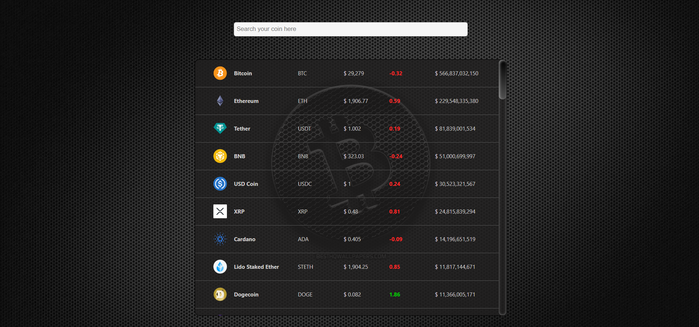

# Welcome to my React Digital Cryptocurrency online Application 👋

## Available Scripts

In the project directory, you can run:
### `npm start`

## Table of contents

- [Overview](#overview)
  - [The challenge](#the-challenge)
  - [Screenshot](#screenshot)
  - [Links](#links)
- [My process](#my-process)
  - [Built with](#built-with)
  - [What I learned](#what-i-learned)
  - [Continued development](#continued-development)
  - [Useful resources](#useful-resources)
- [Author](#author)
- [Acknowledgments](#acknowledgments)

## Overview

Thanks for checking out my Digital Cryptocurrency online app.
Remember that "Every day is a learning day" and try to learn from everyone! 

 ### Screenshot 



### Links

- Live Project URL: [Digital Cryptocurrency Application](https://graceful-daffodil-300119.netlify.app/)

## My process

### Where to find resources

The first think to do is to look for your perfect design! So let's checkout [dribble](https://dribbble.com/) our favourite design to begin!

### Built with

- Reactjs
- Axios
- styled modules
- Semantic HTML5 markup
- CSS Grid
- Mobile-first workflow

You can use any tools you like to help you complete the project. So if you got something you'd like to practice, feel free to give it a try. However, i wrote this design with simple html5 and css and made it responsive for all the devices, since my users should be able to: View the optimal layout

### What I learned

This projects helped me being more familiar with the details of react, its hooks, components, hosting and API, and  create a responsive project with small details on colors,sizes and so on.

To see parts of my codes and see how you can add code snippets, see below:

``` JSX

   useEffect(()=>{

        const fetchAPI = async () => {
            const data = await getCoin();
            setCoins(data);
            console.log(data);
        };
        fetchAPI();

    },[]);

    const handleSearch = (event)=>{
        setSearch(event.target.value)
    }

    const searchedCoins = coins.filter( coin => coin.name.toLowerCase().includes(search.toLowerCase()));


    const Coin = ({name,symbol,image,marketCapChange,price,marketCap}) =>{
        return(
            <>
                <div className={styles.container}>
                    
                    <span className={styles.name}>{name}</span>
                    <span className={styles.symbol}>{symbol.toUpperCase()}</span>
                    <span className={styles.currentPrice}>$ {price.toLocaleString()}</span>
                    <span className={marketCapChange > 1 ? styles.greenPriceChange : styles.redPriceChange}>{marketCapChange.toFixed(2)}</span>
                    <span className={styles.symbol}>$ {marketCap.toLocaleString()}</span>
                </div>
            </>
        );
    }


```
```css
      
  .symbol {
    text-align: left;
    width: 100px;
    color: #cdcbcb;
  }
  
  .currentPrice {
    text-align: left;
    width: 100px;
    color: #cdcbcb;
  }
  
```

### Useful resources

In order to do this project in a correct way you need to have a good knowledge of html and css and js adn react, so let's master at them with these fruitful resources.

- [w3schools](https://www.w3schools.com/) - This helps you a lot with both your css and html which is easy to read and has numerous examples.
- [MDN](https://developer.mozilla.org/en-US/) - Remember that no matter how many tutorial videos you have watched, you always need to learn details and features from codes documentations
- [codeacademy](https://www.codecademy.com/)
- [udemy](https://www.udemy.com/) - Here you can find a number of tutorials in different languages
- [coursera](https://www.coursera.org/)

## Author

- Website - [Elle Famkar](https://bespoke-marigold-f2f8e3.netlify.app/)
- Twitter - [@Ellefamkar](https://www.twitter.com/ellefamkar)

Feel free to ask any questions come to your mind  and send me message via my current temporary website in the link above!

## Acknowledgments

I am thankful to each and every person in this area who teaches me a single piece of code! I learn every single day from amazing people! so I need to thank you all ❤

**Have fun using this project!** 🚀
